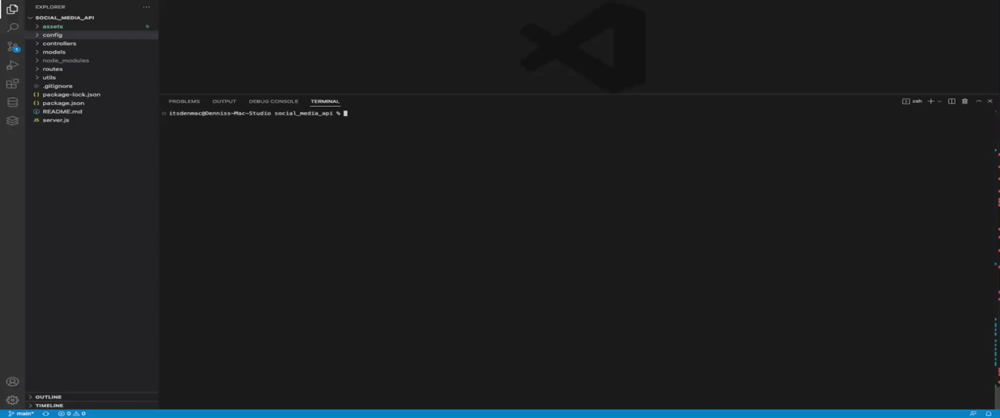
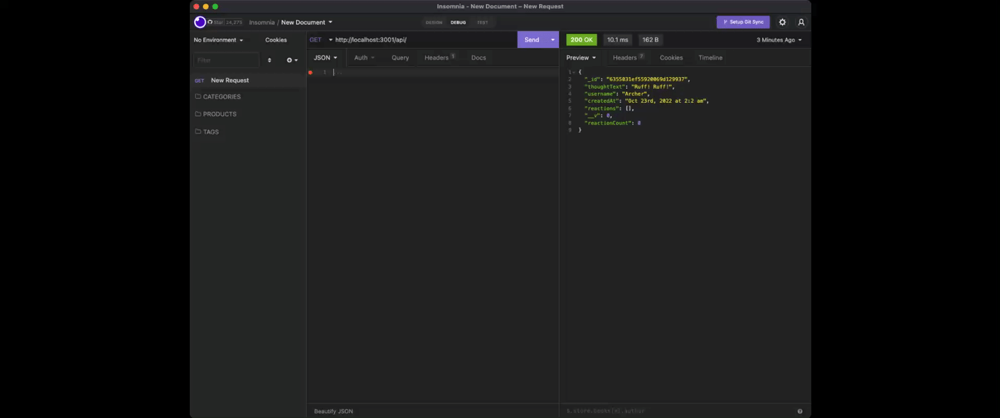
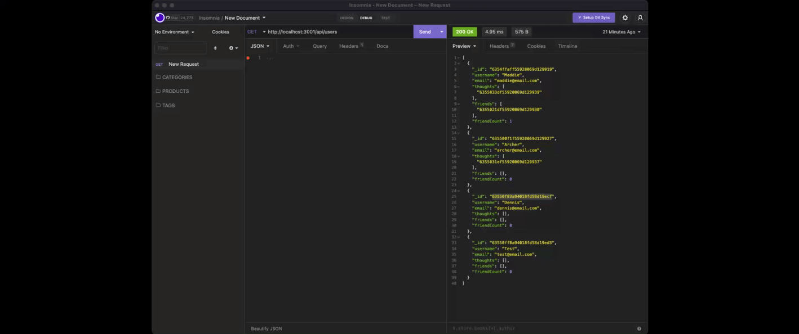
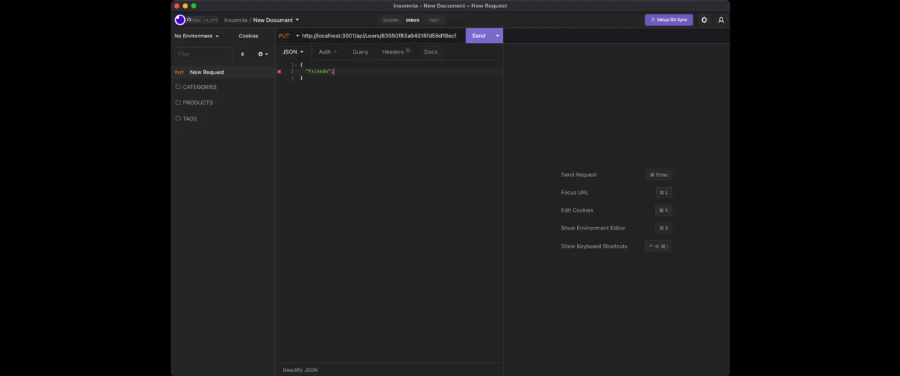

# Social Media API
This is an API for a social network web application where users can share their thoughts, react to friends' thoughts, and create a friend list.

It uses Express.js for routing, a MongoDB database, and the Mongoose ODM. In addition, a JavaScript date library is used to format timestamps.

## User Story
> AS a social media startup

> I WANT an API for my social network that uses a NoSQL database

> SO THAT my website can handle large amounts of unstructured data

## Installation
In able to execute the API, you will have to `git clone` the repository into your local storage. This will enable you to access all the files locally.

Run `npm install` in order to have npm package dependencies installed.
* The API will start once the user enters `npm start` in the command line.
* Once the API is running in the command line, user will be able to access the API through `http://localhost:3001` using `INSOMNIA`. 

## Usage
Users will be able to do the following:
> GET all users at the same time.

> GET all thoughts at the same time.

> GET single user.

> GET single thought.

> POST new, EDIT, and DELETE users.

> POST new, EDIT, and DELETE thoughts.

> POST and DELETE reactions to thoughts.

> POST and DELETE friends.

## Demo
* Initialize API

* GET all users

* GET all thoughts

* GET single user

* GET single thought

* POST, PUT, and DELETE users

* POST, PUT, and DELETE thoughts

* POST and DELETE friends

* POST and DELETE reactions

* ### BONUS: Delete all thoughts associated with the deleted user.

## Video Link to Full Demo
[Social Media API]